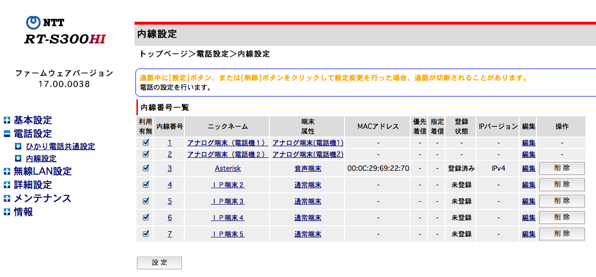
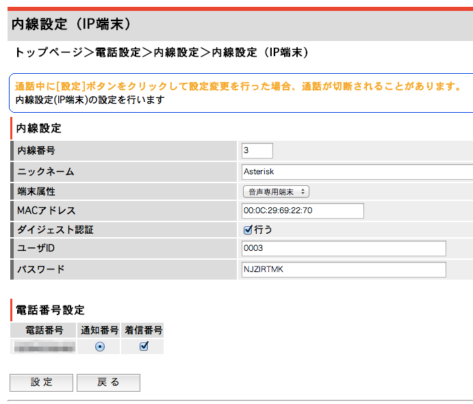
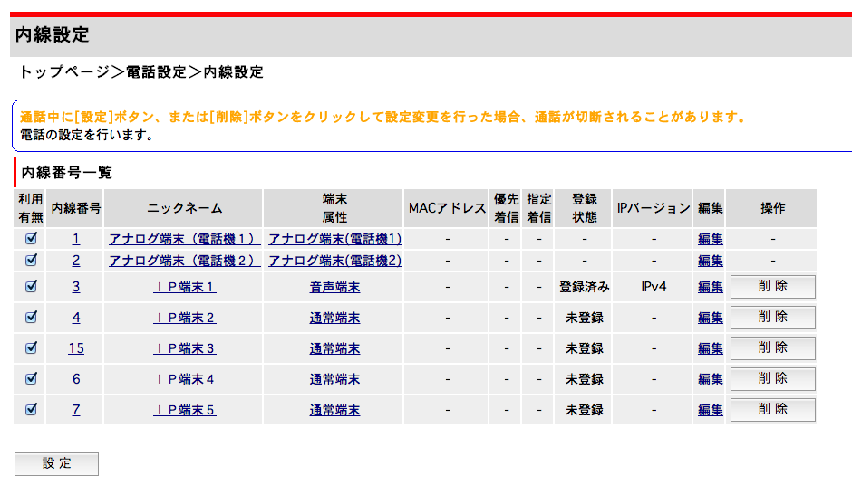
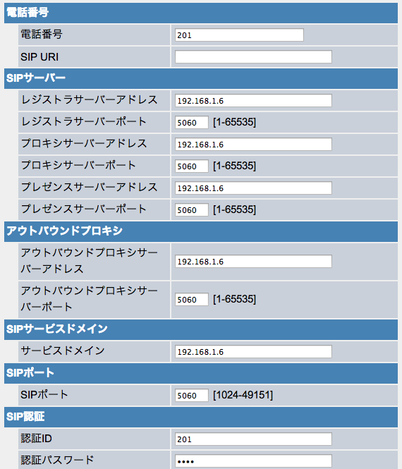

# ひかり電話対応 Asterisk IP-PBXシステム構築

オープンソースIP-PBXシステムAsteriskの構築の記録。  
ここではひかり電話対応のパッチを当てている。  
これを使うときは自己責任で。

## インストール

### 構成

- HGW: `192.168.1.1/24`
- Asterisk: `192.168.1.6/24`
- CentOS6.4 x64
- IP電話機2台

CentOSの中にAsteriskを入れます。  
CentOSはVMwareで仮想化しています。

### 事前準備

- SELinuxは必ずオフにしておくこと。じゃないと動きません。  
- SQLiteおよびSQLite開発パッケージを事前にインストールしておいてください。  
- epel入れてます。
- iptablesはとりあえずオフに。問題の切り分けが難しくなるのでとりあえず動くのが確認できたら設定しましょう。

```
yum -y update
yum -y groupinstall "Development Tools"
yum -y install kernel-devel bison openssl-devel mysql mysql-server mysql-devel \
  gcc gcc-c++ libtermcap-devel kernel-devel bison openssl-devel mysql mysql-server \
  mysql-devel sqllite* wget gcc gcc-c++ make perl libxml2-devel \
  ncurses-devel newt-devel openssl-devel kernel-devel sqlite sqlite-devel
```

### ソースのチェックアウト

今のところはdevelopブランチでしかソースを提供してない。

```
cd /usr/src
git clone git@github.com:wnoguchi/my_asterisk.git asterisk
cd asterisk
git checkout feature/develop
```

### 各種パッケージのビルド・インストール

構成要素は以下のとおり。

- Asterisk
- DAHDI
- Libpri

#### DAHDI

```
cd dahdi*
make all &&
make install

(snip)

###################################################
###
### DAHDI tools installed successfully.
### If you have not done so before, install init scripts with:
###
###   make config
###
###################################################
make[1]: ディレクトリ `/usr/src/asterisk/dahdi-linux-complete-2.7.0+2.7.0/tools' から出ます

make config
cd ..
```

#### Libpri

```
cd libpri-*
make && make install
cd ..
```

#### Asterisk

```
cd asterisk-*
./configure

(snip)
configure: Menuselect build configuration successfully completed

               .$$$$$$$$$$$$$$$=..      
            .$7$7..          .7$$7:.    
          .$$:.                 ,$7.7   
        .$7.     7$$$$           .$$77  
     ..$$.       $$$$$            .$$$7 
    ..7$   .?.   $$$$$   .?.       7$$$.
   $.$.   .$$$7. $$$$7 .7$$$.      .$$$.
 .777.   .$$$$$$77$$$77$$$$$7.      $$$,
 $$$~      .7$$$$$$$$$$$$$7.       .$$$.
.$$7          .7$$$$$$$7:          ?$$$.
$$$          ?7$$$$$$$$$$I        .$$$7 
$$$       .7$$$$$$$$$$$$$$$$      :$$$. 
$$$       $$$$$$7$$$$$$$$$$$$    .$$$.  
$$$        $$$   7$$$7  .$$$    .$$$.   
$$$$             $$$$7         .$$$.    
7$$$7            7$$$$        7$$$      
 $$$$$                        $$$       
  $$$$7.                       $$  (TM)     
   $$$$$$$.           .7$$$$$$  $$      
     $$$$$$$$$$$$7$$$$$$$$$.$$$$$$      
       $$$$$$$$$$$$$$$$.                

configure: Package configured for: 
configure: OS type  : linux-gnu
configure: Host CPU : x86_64
configure: build-cpu:vendor:os: x86_64 : unknown : linux-gnu :
configure: host-cpu:vendor:os: x86_64 : unknown : linux-gnu :


make && make install

(snip)

 +---- Asterisk Installation Complete -------+
 +                                           +
 +    YOU MUST READ THE SECURITY DOCUMENT    +
 +                                           +
 + Asterisk has successfully been installed. +
 + If you would like to install the sample   +
 + configuration files (overwriting any      +
 + existing config files), run:              +
 +                                           +
 +                make samples               +
 +                                           +
 +-----------------  or ---------------------+
 +                                           +
 + You can go ahead and install the asterisk +
 + program documentation now or later run:   +
 +                                           +
 +               make progdocs               +
 +                                           +
 + **Note** This requires that you have      +
 + doxygen installed on your local system    +
 +-------------------------------------------+

```

インストールが終わったらサンプルと設定ファイルを生成します。  
これやらないと `service asterisk start` でこけたりしてろくな事になりません。

```
make samples
make config
```

これで `/etc/asterisk` 直下に設定ファイルが生成されることがわかります。

**再起動しないとうまく動かないので再起動してください。**

```
reboot
```

#### Asteriskを起動してみる

```
chkconfig dahdi on
chkconfig asterisk on
```

どこかで以下のエラー見た。

```
[root@asterisk asterisk-11.0.1]# asterisk -vvvvr
asterisk: error while loading shared libraries: libasteriskssl.so.1: cannot open shared object file: No such file or directory
```

そのときは

```
[root@asterisk asterisk-11.0.1]# ldconfig
```

とする。

それで、

```
service dahdi start
Loading DAHDI hardware modules:
  wct4xxp:                                                 [  OK  ]
  wcte12xp:                                                [  OK  ]
  wcte13xp:                                                [  OK  ]
  wct1xxp:                                                 [  OK  ]
  wcte11xp:                                                [  OK  ]
  wctdm24xxp:                                              [  OK  ]
  wcfxo:                                                   [  OK  ]
  wctdm:                                                   [  OK  ]
  wcb4xxp:                                                 [  OK  ]
  wctc4xxp:                                                [  OK  ]
  xpp_usb:                                                 [  OK  ]

Running dahdi_cfg:                                         [  OK  ]
```

```
service asterisk start
Stopping safe_asterisk:                                    [  OK  ]
Shutting down asterisk:                                    [  OK  ]
asterisk を起動中: 
```

Asteriskが立ち上がっていることを確認する。  
コンソールに接続。

```
[root@asterisk asterisk-11.0.1]# asterisk -vvvvr
Asterisk 11.0.1, Copyright (C) 1999 - 2012 Digium, Inc. and others.
Created by Mark Spencer <markster@digium.com>
Asterisk comes with ABSOLUTELY NO WARRANTY; type 'core show warranty' for details.
This is free software, with components licensed under the GNU General Public
License version 2 and other licenses; you are welcome to redistribute it under
certain conditions. Type 'core show license' for details.
=========================================================================
  == Parsing '/etc/asterisk/asterisk.conf': Found
  == Parsing '/etc/asterisk/extconfig.conf': Found
Connected to Asterisk 11.0.1 currently running on asterisk (pid = 9439)
asterisk*CLI> exit
Executing last minute cleanups
Asterisk cleanly ending (0).
```

ここまででとりあえずAsteriskが入ったことになる。  
このままじゃひかり電話対応のIP-PBXになっていないので、パッチをあてる。

#### 日本語対応パッチの適用

次は日本語対応パッチの適用になります。  
オリジナルパッチは以下。

- http://ftp.voip-info.jp/asterisk/patch/11.0.1/app_voicemail.c.121107-01.patch
- http://ftp.voip-info.jp/asterisk/patch/11.0.1/say.c.121107-01.patch

```
cd /usr/src/asterisk/asterisk-11*
patch -p0 < ../asterisk-patch/app_voicemail.c.121107-01.patch
patch -p0 < ../asterisk-patch/say.c.121107-01.patch
```

#### ひかり電話ホームゲートウェイ対応パッチの適用

次はひかり電話ホームゲートウェイ内線収容対応用パッチの適用になります。
オリジナルパッチは以下。

- http://ftp.voip-info.jp/asterisk/patch/local/11/channels/chan_sip_rt200ne.121107-01.patch

```
cd /usr/src/asterisk/asterisk-11*
patch -p0 < ../asterisk-patch/chan_sip_rt200ne.121107-01.patch
```

ここで再度ビルドをかける

```
cd /usr/src/asterisk/asterisk-11.0.1 && make && make install
```

#### 事前に用意してある設定ファイルのディレクトリを張り替える

Asteriskの設定ファイルは死ぬほど複雑なのでdiffとったらかなり大変。  
なので、さっきチェックアウトしてきた `config` ディレクトリに設定済みのデータを入れたのでそれに張り替える。  
この設定でとりあえず動くっぽい設定になってます。
`resources/sounds/` と `resources/moh/` はサウンドファイル。

```
mkdir -p /root/asterisk-backup
```

##### Asterisk

```
mv /etc/asterisk /root/asterisk-backup
ln -s /usr/src/asterisk/config/asterisk /etc/asterisk
```

##### サウンドファイル

```
ln -s /usr/src/asterisk/resources/sounds/ja /var/lib/asterisk/sounds/ja
```

保留の音声等は他のディレクトリに入っているようなのでこれは以下のようにします。

```
mv /var/lib/asterisk/moh /root/asterisk-backup
ln -s /usr/src/asterisk/src/resources/moh/ /var/lib/asterisk/moh
```

ここまででとりあえず正常にAsteriskが起動することを確認してみる。

```
[root@asterisk asterisk]# service asterisk restart
Stopping safe_asterisk:                                    [  OK  ]
Shutting down asterisk:                                    [  OK  ]
asterisk を起動中: 
[root@asterisk asterisk]# asterisk -vvvvr
Asterisk 11.0.1, Copyright (C) 1999 - 2012 Digium, Inc. and others.
Created by Mark Spencer <markster@digium.com>
Asterisk comes with ABSOLUTELY NO WARRANTY; type 'core show warranty' for details.
This is free software, with components licensed under the GNU General Public
License version 2 and other licenses; you are welcome to redistribute it under
certain conditions. Type 'core show license' for details.
=========================================================================
  == Parsing '/etc/asterisk/asterisk.conf': Found
  == Parsing '/etc/asterisk/extconfig.conf': Found
Connected to Asterisk 11.0.1 currently running on asterisk (pid = 10006)
asterisk*CLI> exit
Executing last minute cleanups
Asterisk cleanly ending (0).
```

OK。

以上でとりあえずインストール作業は終了しました。

## 設定

### ひかり電話ホームゲートウェイ(HGW) RT-S300HI の設定

#### 内線番号一覧

内線番号3をAsterisk用の内線番号としてレジストするようにします。



#### 内線番号3の設定

- 端末属性を「音声専用端末」に設定。



### Asterisk

編集する主なファイルは以下のファイルとなります。

- /etc/asterisk/sip.conf
- /etc/asterisk/extensions.conf
- /etc/asterisk/iax.conf
- /etc/asterisk/voicemail.conf

ここでは内線番号3番にレジストします。

詳しい設定方法はカオスなのでとりあえず省略。  
パッチで変更するところの目安を作ってみました。  
当然ですが、これは設定例なのでこのまま設定しても動きません。

[Asterisk設定例](config/specific_settings.patch)

Asteriskをリブートしてちゃんと内線がレジストできていることを確認する。

```
Created by Mark Spencer <markster@digium.com>
Asterisk comes with ABSOLUTELY NO WARRANTY; type 'core show warranty' for details.
This is free software, with components licensed under the GNU General Public
License version 2 and other licenses; you are welcome to redistribute it under
certain conditions. Type 'core show license' for details.
=========================================================================
  == Parsing '/etc/asterisk/asterisk.conf': Found
  == Parsing '/etc/asterisk/extconfig.conf': Found
Connected to Asterisk 11.0.1 currently running on asterisk (pid = 10006)
asterisk*CLI> core restart now
asterisk*CLI> 
Disconnected from Asterisk server
Executing last minute cleanups
Asterisk cleanly ending (0).
[root@asterisk asterisk]# asterisk -vvvvr
Asterisk 11.0.1, Copyright (C) 1999 - 2012 Digium, Inc. and others.
Created by Mark Spencer <markster@digium.com>
Asterisk comes with ABSOLUTELY NO WARRANTY; type 'core show warranty' for details.
This is free software, with components licensed under the GNU General Public
License version 2 and other licenses; you are welcome to redistribute it under
certain conditions. Type 'core show license' for details.
=========================================================================
  == Parsing '/etc/asterisk/asterisk.conf': Found
  == Parsing '/etc/asterisk/extconfig.conf': Found
Connected to Asterisk 11.0.1 currently running on asterisk (pid = 10006)
[Aug 18 16:07:10] NOTICE[10281]: chan_sip.c:28837 sip_poke_noanswer: Peer 'Lync_Trunk' is now UNREACHABLE!  Last qualify: 0
[Aug 18 16:07:20] ERROR[10316]: tcptls.c:439 ast_tcptls_client_start: Unable to connect SIP socket to 192.168.1.6:5068: Connection refused
asterisk*CLI> sip show peers
Name/username             Host                                    Dyn Forcerport ACL Port     Status      Description                      
192.168.1.1/0003          192.168.1.1                                  a             5060     OK (5 ms)                                    
201/201                   192.168.1.4                              D   a             5060     OK (151 ms)                                  
202/202                   192.168.1.5                              D   a             5060     OK (151 ms)                                  
203/203                   (Unspecified)                            D   a             0        UNKNOWN                                      
204/204                   (Unspecified)                            D   a             0        UNKNOWN                                      
205/205                   (Unspecified)                            D   a             0        UNKNOWN                                      
Exchange                  192.168.1.6                                  a             5060     OK (1 ms)                                    
Lync_Trunk                192.168.1.6                                  a             5068     UNREACHABLE                                  
8 sip peers [Monitored: 4 online, 4 offline Unmonitored: 0 online, 0 offline]

```

レジストできていると以下のようにひかり電話ルーターで「登録済み」となります。



### IP電話機を設定する

メーカー製のビジネスホン等は独自のプロトコルを使用していて使えない可能性が非常に高いのでおすすめしません。  
国産でAsteriskに対応していることが確認できているのは以下の2機種です。

- [Amazon.co.jp： パナソニック SIP電話機 KX-UT123N: パソコン・周辺機器](http://www.amazon.co.jp/%E3%83%91%E3%83%8A%E3%82%BD%E3%83%8B%E3%83%83%E3%82%AF-KX-UT123N-SIP%E9%9B%BB%E8%A9%B1%E6%A9%9F/dp/B0065CRXRU)
- [KX-UT136N | 商品一覧 | SIP電話機 | Panasonic](http://panasonic.biz/netsys/sipphone/products/ut136n/)

KX-UT136Nはビジネスの特性が強いのであまり市場に出回っていません。  
海外製のIP電話のようにクセが強くないし、ディスプレイが漢字表示にも対応していいてマニュアルもダウンロード出来るので、
Amazonから気軽に調達できる KX-UT123N が一番リーズナブルで敷居が低いのではないでしょうか。

PoE対応のスイッチに接続するか、ACアダプタ付きで購入してください。  
**デフォルトだとACアダプタはついてきません。**

もちろんAsteriskへレジストする設定を入れないと動かないので設定します。  
基本的にWebプログラミングで設定します。  
内蔵Webポートを開けてください。  
そうしないとアクセスできません。  
リスタートしたりするたびにポートが閉じるのでそのたびに開けてください。

デフォルトアカウントは

- ID: `admin`
- PASS: `adminpass`

となります。このとき間違って一般ユーザーとしてログインしてしまわないように注意。  
SIPの設定ができません。

設定例は以下のとおり。
**SIP URIの項目を空にしないとレジストできないので注意。**



## コマンド体系

以下、付録。  
まず以下のコマンドでAsteriskのコンソールに接続する。

```
asterisk -vvvvr
```

### SIP端末のレジストのステータスを確認する

```
sip show peers
```

### 設定ファイル再読み込み

```
core reload
```

### Asteriskを再起動する

なんかおかしくなったらとりあえず再起動してみよう。

```
core restart now
```

## 余談

とりあえず使えるんだけど、コンソール立ち上げてる時に吐き出されるこのエラーってなんなのかなぁ。。。気持ち悪い。

```
[Aug 18 16:07:10] NOTICE[10281]: chan_sip.c:28837 sip_poke_noanswer: Peer 'Lync_Trunk' is now UNREACHABLE!  Last qualify: 0
[Aug 18 16:07:20] ERROR[10316]: tcptls.c:439 ast_tcptls_client_start: Unable to connect SIP socket to 192.168.1.6:5068: Connection refused
[Aug 18 16:07:34] ERROR[10318]: tcptls.c:439 ast_tcptls_client_start: Unable to connect SIP socket to 192.168.1.6:5068: Connection refused
[Aug 18 16:07:48] ERROR[10324]: tcptls.c:439 ast_tcptls_client_start: Unable to connect SIP socket to 192.168.1.6:5068: Connection refused
[Aug 18 16:08:02] ERROR[10326]: tcptls.c:439 ast_tcptls_client_start: Unable to connect SIP socket to 192.168.1.6:5068: Connection refused
[Aug 18 16:08:16] ERROR[10334]: tcptls.c:439 ast_tcptls_client_start: Unable to connect SIP socket to 192.168.1.6:5068: Connection refused
[Aug 18 16:08:30] ERROR[10336]: tcptls.c:439 ast_tcptls_client_start: Unable to connect SIP socket to 192.168.1.6:5068: Connection refused
[Aug 18 16:08:44] ERROR[10405]: tcptls.c:439 ast_tcptls_client_start: Unable to connect SIP socket to 192.168.1.6:5068: Connection refused
[Aug 18 16:08:58] ERROR[10407]: tcptls.c:439 ast_tcptls_client_start: Unable to connect SIP socket to 192.168.1.6:5068: Connection refused
[Aug 18 16:09:12] ERROR[10411]: tcptls.c:439 ast_tcptls_client_start: Unable to connect SIP socket to 192.168.1.6:5068: Connection refused

```

## 参考サイト

### 公式

* [Asterisk custom communications - PBX, VoIP gateways, IVRs and more...](http://www.asterisk.org/)
* [Install Asterisk Source Code](http://www.asterisk.org/downloads/source-code)

### インストール全般

* [やまさんノート CentOS 6.3 に Asterisk 11 を構成 － Asterisk のインストール](http://yama30501.blog137.fc2.com/blog-entry-151.html)
* [やまさんノート CentOS 6.3 に Asterisk 11 を構成 － Asterisk へのパッチ当て](http://yama30501.blog137.fc2.com/blog-entry-152.html)
* [やまさんノート CentOS 6.3 に Asterisk 11 を構成 － 日本語音声ファイルのインストール](http://yama30501.blog137.fc2.com/blog-entry-153.html)
* [やまさんノート CentOS 6.3 に Asterisk 11 を構成 － Asterisk の設定](http://yama30501.blog137.fc2.com/blog-entry-154.html)
* [やまさんノート Asterisk 11 の動作テスト － ソフトフォン（ZoIPer）による内線・外線テスト](http://yama30501.blog137.fc2.com/blog-entry-155.html)
* [やまさんノート CentOS 6.3 に Asterisk 11 を構成 － FAX 機能の構成](http://yama30501.blog137.fc2.com/blog-entry-156.html)

### IP電話の設定について

- [パナソニック電話機対応 - VOIP-Info.jp Wiki](http://www.voip-info.jp/index.php/%E3%83%91%E3%83%8A%E3%82%BD%E3%83%8B%E3%83%83%E3%82%AF%E9%9B%BB%E8%A9%B1%E6%A9%9F%E5%AF%BE%E5%BF%9C)
- [Amazon.co.jp： パナソニック SIP電話機 KX-UT123N: パソコン・周辺機器](http://www.amazon.co.jp/%E3%83%91%E3%83%8A%E3%82%BD%E3%83%8B%E3%83%83%E3%82%AF-KX-UT123N-SIP%E9%9B%BB%E8%A9%B1%E6%A9%9F/dp/B0065CRXRU)
- [KX-UT136N | 商品一覧 | SIP電話機 | Panasonic](http://panasonic.biz/netsys/sipphone/products/ut136n/)
